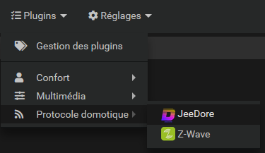
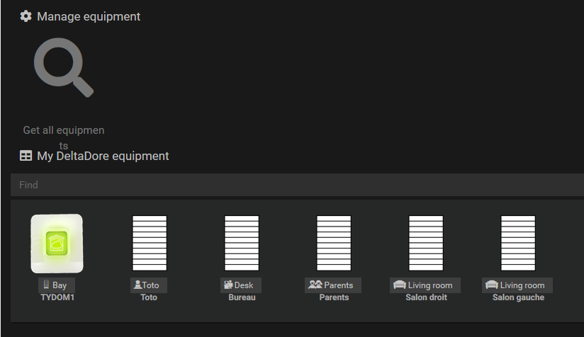

# Présentation de JeeDore

Le plugin **JeeDore** permet de piloter les équipements [DeltaDore]("https://www.deltadore.fr/") via une box Tydom.
Ainsi, les équipements compatibles avec Tydom peuvent être pilotés par Jeedom.
Certaines icones du plugin proviennent du site https://icones8.fr/

# Installation

## Activation du plugin

Le plugin **JeeDore** doit être installé via le market Jeedom.

Dès que le plugin est installé, il suffit d'activer le plugin.

Après l'activation du plugin :

## Installation des dépendances

Le plugin est composé d'un démon développé en .Net Core qui requiert le runtime .Net pour les architectures x86, arm et arm64. Jeedom installera les dépendances dans les 5 min. Elles seront également réinstallées lors d’une mise à jour du plugin si besoin.

## Statut du démon

Le démon peut être dans deux états, démarré ou arreté.

Démon arrêté : 

Démon demarré : 

Pour démarrer le démon, il suffit de clicker sur le bouton **(Re)Démarrer** de Jeedom.

## Configuration

Pour que **JeeDore** puisse piloter une box Tydom, il faut rensigner l'adresse MAC et le mot de passe.
Une adresse MAC est un nombre au format hexadécimal se situant sur la Tydom. Elle est composé de 12 caractères.

L'adresse MAC se situe sur votre Tydom :

Il est possible de choisir le type de connection :
* Local, l'adresse IP de votre Tydom doit être saisi. Vous pouvez la retrouver dans l'application Tydom de Delta Dore dans le menu _A propos_.
* Remote, l'identification et l'envoi de toutes les commandes passent par les serveurs Delta Dore

> Le type _Local_ est **fortement** conseillé pour avoir une connection fiable.

**JeeDore** dispose de deux thèmes : Sombre et Clair. Cela change les icônes de noir sur blanc en blanc sur noir.

Il suffit de clicker sur le bouton _Sauvgarder_ pour appliquer les modifications.

# Compatiblité

## Plateforme

**JeeDore** est compatible sur les plateformes suivantes :
* Docker (testé sur Synology)
* Raspberry Pi 2, 3
* Jeedom Smart
* Freebox Delta

> Si une plateformne n'est pas mentionnée, cela signifie qu'aucun retour utilisateur a été fait.

## Type d'équipement et commande

### Tydom

* productName : nom du produit
* mac : adresse MAC
* config : ?
* bddEmpty : base de données vide
* bddStatus : non documenté
* apiMode : non documenté        | 1                   |
* mainVersionSW : version logiciel Tydom
* mainId : non documenté
* mainReference : plan logiciel Tydom
* keyVersionSW : version logiciel clé
* keyVersionHW : version matériel Tydom
* keyVersionStack : version logiciel stack
* keyReference : plan logiciel clé
* bootReference : plan logiciel boot
* bootVersion : version logiciel boot
* tydomDat : version Tydom.dat
* momJson : version Mom.Json
* gatewayDat : version Gateway.Json
* momApiJson : version Mom_Api.Json
* scenarioJson : version Scenario.Json
* configJson : version Config.Json
* updateAvailable : version disponible
* longitude : longitude
* latitude : latitude
* timezone : fuseau horaire (en minutes)
* summerOffset : heure d'été/hiver
* bddJson : version Bdd.Json
* collectJson : version Collect.Json
* groupsJson : version Groups.Json
* urlMediation : url utilisé pour la connection sur les serveurs DeltaDore

### Scénario

  * play : executer un scénario défini sur la box Tydom

### Volets roulants

* up : monte le volet
* down : descends le volet
* stop : arrête le mouvement du volet
* setPosition : défini l'ouverture du volet en pourcentage
  > Cette commande n'est pas compatible avec tous les modèles de volet. Pour palier, il suffit de faire un scénario sur Jeedom, de _up_ le volet, faire une pause de 2s et de faire un _stop_
* getPosition : pourcentage d'ouverture du volet

### Lumière

  * levelon : allumer
  * leveloff : éteindre
  * levelCmdToggle : inverse la position de la lumière
  * getLevel : retour d'état pour connaître l'intensité en pourcentage

### Porte d'entrée

* openstate : retour d'état pour savoir si une porte est ouverte

### Chauffage/climatisation

#### Commandes

  * modifier la température à atteindre
  * valeur de la température
  * toutes les autres fonctionnalités sont en cours de developpement
#### Modèles validés

* DELTA 8000 TA RF

> Cette liste n'est pas exhaustive

### Alarme
* prévu
### Fenêtre
* prévu

> Tous les équipements DeltaDore ne sont pas encore tous compatibles. La prise en charge de nouveaux équipements est en cours.

# Utilisation

## Synchronisation des équipements

Pour que Jeedom puisse connaître les équipements associés via l'application Tydom de Delta Dore, il faut se rendre sue la page du plugin

et de clicker sur le bouton __Synchroniser équipement__.

Une fois la synchronisation réalisée, tous vos équipements pris en compte s'afficheront.

Lors d'un click sur un équipement, il est possible de tester les commandes disponibles sur cet équipement et de les tester.

Dans un scénario, il est possible d'appeler les commandes.

# Changelog

[Changelog]("https://www.deltadore.fr/")

Eli.
